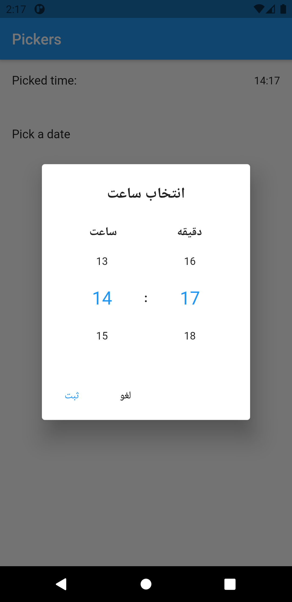
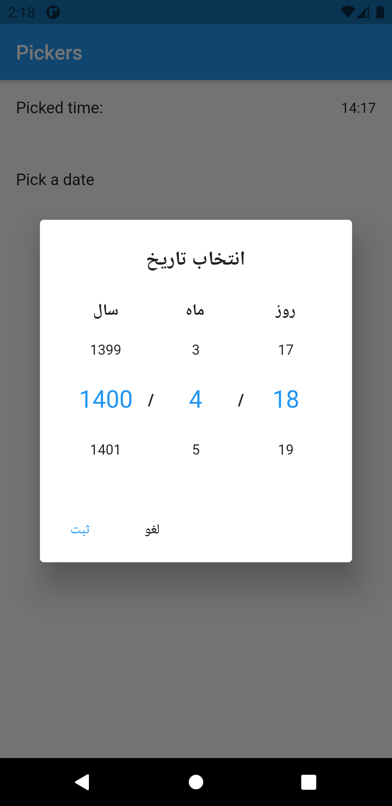

# Persian Datetime Pickers

[](https://pub.dev/packages/persian_datetimepickers)
[](https://github.com/gabrimatic/persian_datetimepickers/actions/workflows/ci.yml)
[](LICENSE)
[]()
[]()

Persian Datetime Pickers gives Flutter apps compact numeric date and time dialogs for Persian (Jalali) and Gregorian workflows. You use it when the standard Material date picker is too calendar-heavy and you want a small picker that stays clear in Persian, English, right-to-left, and left-to-right screens.

The package returns normal Flutter values: `DateTime`, milliseconds since epoch, and `TimeOfDay`. It supports custom labels, custom text styles, date ranges, Jalali conversion, and simple formatting helpers.

<p align="center">
  
  
</p>

## At a Glance

| Surface | What you get |
|---------|--------------|
| Jalali date picker | Numeric year, month, and day picker with Persian labels by default. |
| Gregorian date picker | Same dialog shape with English labels and Gregorian date output. |
| Time picker | 24-hour picker with valid `00:00` through `23:59` support. |
| Range control | `firstDate` and `lastDate` clamp the selectable year, month, and day values. |
| Styling | `PersianDateTimeStyle` controls accent color and text styles. |
| Formatting helpers | `toPersianDate()`, `toFancyString()`, and `TimeOfDay.toFancyString()`. |

## Quick Start

Requirements: **Flutter >= 3.10** and **Dart >= 3.0**.

```yaml
dependencies:
  persian_datetimepickers: ^1.1.1
```

```dart
import 'package:persian_datetimepickers/persian_datetimepickers.dart';
```

## Date Picker

Default behavior: the picker opens in Jalali mode and returns a Gregorian `DateTime`.

```dart
final date = await showPersianDatePicker(
  context: context,
  initialDate: DateTime.now(),
  firstDate: DateTime(2020),
  lastDate: DateTime(2035, 12, 31),
);

if (date != null) {
  print(date.toPersianDate());
}
```

Use Gregorian mode when you want English labels and Gregorian number ranges:

```dart
final date = await showPersianDatePicker(
  context: context,
  isJalali: false,
  initialDate: DateTime(2024, 2, 29),
);
```

Use the timestamp helper when storage needs milliseconds:

```dart
final timestamp = await showPersianDatePickerTimestamp(
  context: context,
  firstDate: DateTime(2020),
  lastDate: DateTime(2035, 12, 31),
);
```

## Time Picker

Default behavior: the picker uses a 24-hour clock and returns `TimeOfDay`.

```dart
final time = await showPersianTimePicker(
  context: context,
  initialTime: const TimeOfDay(hour: 0, minute: 5),
);

if (time != null) {
  print(time.toFancyString()); // 00:05
}
```

## Labels

Override any visible dialog label without replacing the picker UI:

```dart
await showPersianDatePicker(
  context: context,
  titleText: 'Select deadline',
  yearLabelText: 'Year',
  monthLabelText: 'Month',
  dayLabelText: 'Day',
  cancelText: 'Back',
  saveText: 'Use date',
);
```

The time picker accepts the same `titleText`, `cancelText`, and `saveText` parameters, plus `hourLabelText` and `minuteLabelText`.

## Styling

Set the accent color and text styles with `PersianDateTimeStyle`:

```dart
await showPersianDatePicker(
  context: context,
  persianDateTimeStyle: PersianDateTimeStyle(
    color: Colors.purple,
    headingStyle: const TextStyle(fontSize: 22, fontWeight: FontWeight.bold),
    titleStyle: const TextStyle(fontSize: 18, fontWeight: FontWeight.w600),
    numbersStyle: const TextStyle(fontSize: 16),
  ),
);
```

## Development

```bash
flutter pub get
flutter analyze
flutter test
dart pub publish --dry-run
```

Run the example:

```bash
cd example
flutter run
```

## Links

[pub.dev](https://pub.dev/packages/persian_datetimepickers) · [GitHub](https://github.com/gabrimatic/persian_datetimepickers) · [Issues](https://github.com/gabrimatic/persian_datetimepickers/issues) · [More packages](https://pub.dev/publishers/gabrimatic.info/packages)
